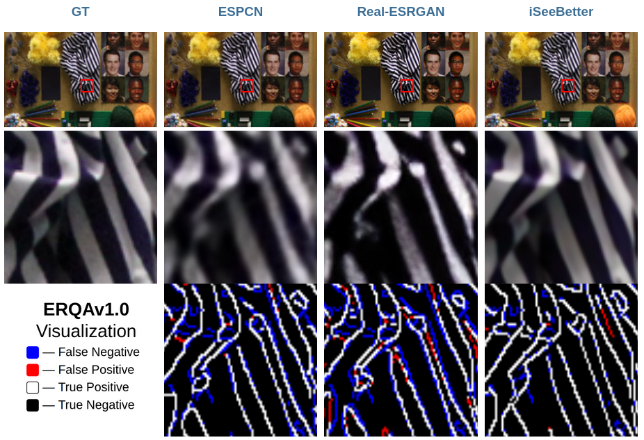

# ERQA - Edge Restoration Quality Assessment

ERQA - a full-reference quality metric designed to analyze how good image and video restoration methods (SR, deblurring, denoising, etc) are restoring real details.

It is part of [MSU Video Super Resolution Benchmark](https://videoprocessing.ai/benchmarks/video-super-resolution.html) project.


## Quick start

Run `pip install erqa` and run it from command line or directly from Python code.

### Command line

```shell
python -m erqa /path/to/target.png /path/to/gt.png
```

### Python code

```python
import erqa
import cv2

# Target and gt should be uint8 arrays of equal shape (H, W, 3) in BGR format
target = cv2.imread('/path/to/target.png')
gt = cv2.imread('/path/to/gt.png')

metric = erqa.ERQA()
v = metric(target, gt)
```

## Description

The ERQA metric analyzes how details were reconstructed in an image compared to ground-truth.
 - **ERQA = 1.0** means perfect restoration
 - **ERQA = 0.0** means worst restoration

Visualization of the metric shows underlying mask showing where image is distorted.
 - **Blue** means there is a missing detail (False Negative)
 - **Red** means there is a misplaced detail (False Positive)
 - **White** means perfect details restoration (True Positive)
 - **Black** means perfect background restoration (True Negative)



## Local setup

You can get source code up and running using following commands:

```shell
git clone https://github.com/msu-video-group/erqa
cd erqa
pip install -r requirements.txt
```

## Cite us

⌛**Soon**⌛
